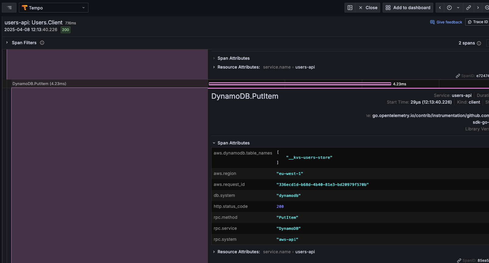

[](https://gitlab.com/iskaypetcom/digital/sre/tools/dev/go-kvs-client/-/commits/main)
[](https://gitlab.com/iskaypetcom/digital/sre/tools/dev/go-kvs-client/-/commits/main)
[](https://gitlab.com/iskaypetcom/digital/sre/tools/dev/go-kvs-client/-/releases)

> This package provides a high-level abstract for KVS (Key Value Store) distributed client (beta)

example
```go
package main

import (
	"context"
	"fmt"
	"strconv"

	"github.com/aws/aws-sdk-go-v2/config"
	"go.opentelemetry.io/contrib/instrumentation/github.com/aws/aws-sdk-go-v2/otelaws"

	"examples/local/infrastructure"
	"examples/local/model"

	"gitlab.com/iskaypetcom/digital/sre/tools/dev/go-kvs-client/kvs/dynamodb"
	"gitlab.com/iskaypetcom/digital/sre/tools/dev/go-logger/log"
	"gitlab.com/iskaypetcom/digital/sre/tools/dev/go-relic/otel/tracing"
)

func main() {
	ctx := context.Background()

	app, err := tracing.New(ctx,
		tracing.WithAppName("users-api"),
		tracing.WithProtocol(tracing.NewGRPCProtocol("localhost:4317")))
	checkErr(err)
	defer app.Shutdown(ctx)

	cfg, err := config.LoadDefaultConfig(ctx)
	checkErr(err)
	otelaws.AppendMiddlewares(&cfg.APIOptions)

	kvsClient := infrastructure.NewAWSKVSClient[model.UserDTO](
		dynamodb.NewBuilder(
			dynamodb.WithTTL(7*24*60*60),
			dynamodb.WithContainerName("users-store"),
			dynamodb.WithEndpointResolver("http://localhost:4566"),
		).Build(cfg),
	)

	// Single item: Save + Get
	for i := 1; i <= 20; i++ {
		childCtx, transaction := tracing.NewTransaction(ctx, "Users.Client", tracing.SetTransactionType(tracing.Client))
		key := fmt.Sprintf("USER:%d:v1", i)
		user := &model.UserDTO{ID: i, FirstName: "John Doe"}
		if kvsError := kvsClient.SaveWithContext(childCtx, key, user, 10); kvsError != nil {
			log.Error(kvsError)
			continue
		}
		value, kvsErr := kvsClient.Get(key)
		if kvsErr != nil {
			log.Error(kvsErr)
			continue
		}
		log.Infof("Item %s: %+v", key, value)
		transaction.End()
	}

	// Bulk save + get
	users := []model.UserDTO{
		{ID: 101, FirstName: "Jane Doe"},
		{ID: 102, FirstName: "Alice Doe"},
		{ID: 103, FirstName: "Bob Doe"},
	}
	err = kvsClient.BulkSaveWithContext(ctx, users, func(userDTO model.UserDTO) string {
		return strconv.Itoa(userDTO.ID)
	})
	checkErr(err)

	keys := []string{"101", "102", "103"}
	items, err := kvsClient.BulkGetWithContext(ctx, keys)
	checkErr(err)

	for i, item := range items {
		log.Infof("Item %d: %+v", i+1, item)
	}
}

func checkErr(err error) {
	if err != nil {
		log.Fatal(err)
	}
}

```

## Prometheus

example 
```text
__kvs_operations{client_name="client_name", type="get"} 10 
__kvs_operations{client_name="client_name", type="save"} 15 
__kvs_operations{client_name="client_name", type="bulk_get"} 8 
__kvs_operations{client_name="client_name", type="bulk_save"} 5
__kvs_stats{client_name="client_name", stats="hit"} 1
__kvs_stats{client_name="client_name", stats="miss"} 1
__kvs_stats{client_name="client_name", stats="error"} 0
__kvs_connection{client_name="client_name", type="get"} 0.005 
__kvs_connection{client_name="client_name", type="save"} 0.002 
__kvs_connection{client_name="client_name", type="bulk_get"} 0.010 
__kvs_connection{client_name="client_name", type="bulk_save"} 0.012
```

## Tempo

