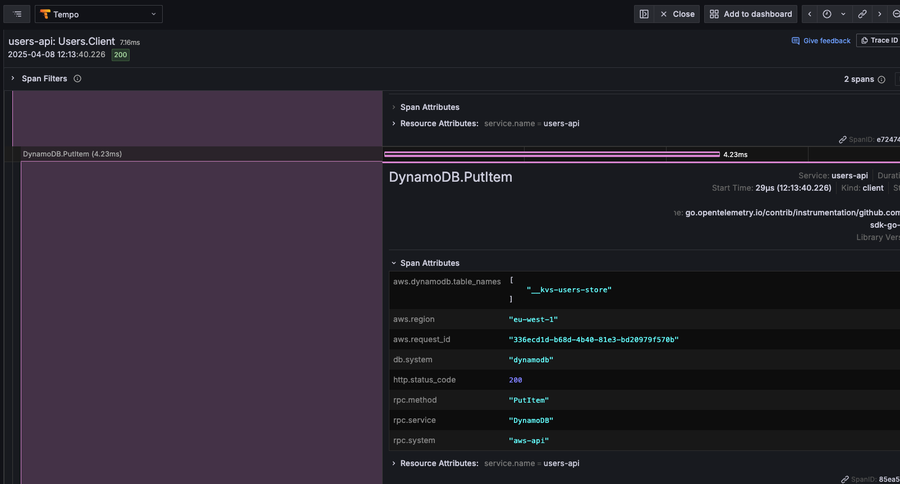

# go-kvs-client

[](https://pkg.go.dev/github.com/arielsrv/go-kvs-client)
[](https://goreportcard.com/report/github.com/arielsrv/go-kvs-client)
[](LICENSE)


A **generic**, **observable** Go client for distributed Key-Value Stores. Ships with an AWS DynamoDB backend, an optional in-memory cache, Prometheus metrics and OpenTelemetry tracing out of the box.

> ⚠️ **Status:** Beta. The public API may change before `v1.0.0`.

---

## Table of Contents

- [Features](#features)
- [Requirements](#requirements)
- [Installation](#installation)
- [Quick Start](#quick-start)
- [Usage](#usage)
  - [Client construction](#client-construction)
  - [Single item operations](#single-item-operations)
  - [Bulk operations](#bulk-operations)
- [API Reference](#api-reference)
- [Builder options (DynamoDB)](#builder-options-dynamodb)
- [Observability](#observability)
  - [Prometheus metrics](#prometheus-metrics)
  - [OpenTelemetry tracing](#opentelemetry-tracing)
- [Local development](#local-development)
- [Project layout](#project-layout)
- [Roadmap](#roadmap)
- [Contributing](#contributing)
- [License](#license)

---

## Features

- 🧬 **Generic, typed API** (Go generics): `Get`, `Save`, `BulkGet`, `BulkSave` — each with a `*WithContext` variant.
- ☁️ **AWS DynamoDB** implementation with a fluent builder (TTL, table name, custom endpoint/LocalStack, etc.).
- ⚡ **Optional in-memory cache** (`freecache` via `gocache`) to reduce latency; hits/misses exported as metrics.
- 📈 **Prometheus metrics**: operation counters, connection latencies, hit/miss/error stats.
- 🔭 **OpenTelemetry tracing** integrated with AWS SDK v2 (`otelaws`); demo with Tempo + Grafana.
- 🧪 **Mocks included** under `resources/mocks/` (generated with `mockery`) for easy unit testing.
- 📦 **Runnable examples**: `examples/simple` and `examples/trace`.

## Requirements

- Go **1.26+**
- AWS credentials or [LocalStack](https://www.localstack.cloud/) for local development
- (Optional) [Docker](https://www.docker.com/) + Docker Compose for the local observability stack
- (Optional) [Task](https://taskfile.dev/) to run the project tasks

## Installation

```shell
go get github.com/arielsrv/go-kvs-client@latest
```

## Quick Start

Spin up LocalStack, provision the DynamoDB table with Terraform and run the example:

```shell
# 1) Start LocalStack + Prometheus + Grafana + Tempo
task awslocal:start
task tf:init
task tf:apply

# 2) Run the simple example
go run ./examples/simple

# 3) Inspect the data in LocalStack
open "https://app.localstack.cloud/inst/default/resources/dynamodb/tables/__kvs-users-store/items"
```

## Usage

### Client construction

```go
import (
    "context"
    "time"

    "github.com/arielsrv/go-kvs-client/kvs"
    "github.com/arielsrv/go-kvs-client/kvs/dynamodb"
    "github.com/aws/aws-sdk-go-v2/config"
)

ctx := context.Background()
cfg, err := config.LoadDefaultConfig(ctx)
if err != nil {
    panic(err)
}

client := kvs.NewAWSKVSClient[UserDTO](
    dynamodb.NewBuilder(
        dynamodb.WithTTL(24*time.Hour),
        dynamodb.WithContainerName("__kvs-users-store"),
        dynamodb.WithEndpointResolver("http://localhost:4566"), // LocalStack
    ).Build(cfg),
)
```

### Single item operations

```go
key := "USER:1:v1"
user := &UserDTO{ID: 1, FirstName: "John", LastName: "Doe", FullName: "John Doe"}

// Save with a per-item TTL (overrides the builder default)
if err := client.SaveWithContext(ctx, key, user, 10*time.Second); err != nil {
    log.Fatal(err)
}

got, err := client.GetWithContext(ctx, key)
if err != nil {
    log.Fatal(err)
}
fmt.Printf("%+v\n", got)
```

### Bulk operations

```go
users := []UserDTO{
    {ID: 101, FirstName: "Jane",  LastName: "Doe", FullName: "Jane Doe"},
    {ID: 102, FirstName: "Bob",   LastName: "Doe", FullName: "Bob Doe"},
    {ID: 103, FirstName: "Alice", LastName: "Doe", FullName: "Alice Doe"},
}

err := client.BulkSaveWithContext(ctx, users, func(u UserDTO) string {
    return strconv.Itoa(u.ID)
})
if err != nil {
    log.Fatal(err)
}

items, err := client.BulkGetWithContext(ctx, []string{"101", "102", "103"})
if err != nil {
    log.Fatal(err)
}
for _, it := range items {
    fmt.Printf("%+v\n", it)
}
```

Full working code: [`examples/simple`](examples/simple) and [`examples/trace`](examples/trace).

## API Reference

The public `kvs.Client[T any]` interface:

| Method | Description |
| --- | --- |
| `Get(key string) (*T, error)` | Retrieve a single item by key. |
| `BulkGet(keys []string) ([]T, error)` | Retrieve multiple items by keys. |
| `Save(key string, item *T, ttl ...time.Duration) error` | Store an item, optionally with TTL. |
| `BulkSave(items []T, keyMapper KeyMapperFunc[T], ttl ...time.Duration) error` | Store multiple items; `keyMapper` extracts the key from each item. |
| `GetWithContext`, `BulkGetWithContext`, `SaveWithContext`, `BulkSaveWithContext` | Context-aware variants of the above. |

`KeyMapperFunc[T] = func(item T) string`.

## Builder options (DynamoDB)

| Option | Purpose |
| --- | --- |
| `WithContainerName(name string)` | Target DynamoDB table name. |
| `WithTTL(d time.Duration)` | Default TTL applied to written items. |
| `WithEndpointResolver(url string)` | Custom endpoint (e.g. LocalStack at `http://localhost:4566`). |

See [`kvs/dynamodb/builder.go`](kvs/dynamodb/builder.go) for the complete list.

## Observability

### Prometheus metrics

The client exports the following series (indicative):

```text
__kvs_operations{client_name="<name>", type="get|save|bulk_get|bulk_save"}   counter
__kvs_stats     {client_name="<name>", stats="hit|miss|error"}              counter
__kvs_connection{client_name="<name>", type="get|save|bulk_get|bulk_save"}  histogram (seconds)
```

Grafana dashboards are provided in [`resources/grafana/`](resources/grafana) and can be imported as-is.

### OpenTelemetry tracing

The DynamoDB client integrates with AWS SDK v2 through `otelaws.AppendMiddlewares`. A complete end-to-end example (OTLP exporter → Tempo → Grafana) lives in [`examples/trace`](examples/trace).



## Local development

Common commands (via [Taskfile](Taskfile.yml)):

```shell
task download         # sync workspace + tidy modules
task test             # generate mocks + run tests (incl. -race)
task lint             # golangci-lint + gofumpt + betteralign
task docker:compose   # bring up Prometheus + Grafana + Tempo
task awslocal:start   # start LocalStack
task tf:init && task tf:apply  # provision DynamoDB tables
```

Or use the standard Go toolchain directly:

```shell
go test ./...
go run ./examples/simple
go run ./examples/trace
```

## Project layout

```
.
├── kvs/                  # Public API + AWS implementation
│   ├── kvs_client.go     # Client[T] interface
│   ├── aws_kvs_client.go # AWS-backed implementation
│   └── dynamodb/         # DynamoDB low-level client + builder
├── examples/             # Runnable examples (simple, trace)
├── resources/
│   ├── grafana/          # Dashboards
│   ├── mocks/            # Generated mocks (mockery)
│   └── setup/
│       ├── docker/       # docker-compose stack (Prom/Grafana/Tempo)
│       └── terraform/    # DynamoDB table provisioning
└── Taskfile.yml
```

## Roadmap

- [ ] Additional providers: AWS ElastiCache / MemoryDB
- [ ] GCP and Azure KVS backends
- [ ] Pluggable cache backends (Redis, Ristretto)
- [ ] `v1.0.0` API stabilization

Proposals and PRs are welcome.

## Contributing

1. Fork the repository and create a feature branch.
2. Run `task default` (download + lint + test) before opening a PR.
3. Make sure new code is covered by tests and, if it changes the public API, by documentation.

## License

Distributed under the **MIT License**. See [`LICENSE`](LICENSE) for the full text.
