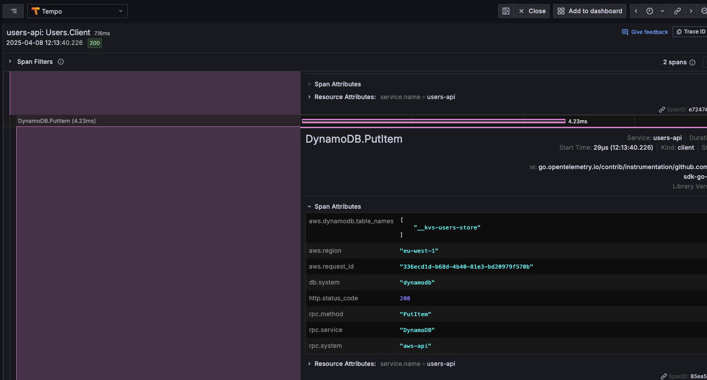

# go-kvs-client

[](https://pkg.go.dev/github.com/arielsrv/go-kvs-client)
[](https://github.com/arielsrv/go-kvs-client/actions/workflows/ci.yml)
[](https://github.com/arielsrv/go-kvs-client/actions/workflows/lint.yml)
[](https://goreportcard.com/report/github.com/arielsrv/go-kvs-client)
[](https://github.com/arielsrv/go-kvs-client/releases/latest)
[](LICENSE)


A **generic**, **observable** Go client for distributed Key-Value Stores. Ships with **AWS DynamoDB** and **Redis** backends, OpenTelemetry tracing and metrics, in-memory fakes for testing, and runnable examples.

> **Status:** Released and versioned with SemVer — the public API is stable across `v1.x`.
> See the [releases](https://github.com/arielsrv/go-kvs-client/releases) page for the changelog.

---

## Table of Contents

- [Features](#features)
- [Requirements](#requirements)
- [Installation](#installation)
- [Quick Start](#quick-start)
- [Usage](#usage)
  - [Client construction](#client-construction)
  - [Single item operations](#single-item-operations)
  - [Bulk operations](#bulk-operations)
- [API Reference](#api-reference)
- [Error handling](#error-handling)
- [Builder options (DynamoDB)](#builder-options-dynamodb)
- [Builder options (Redis)](#builder-options-redis)
  - [Testing without Redis](#testing-without-redis)
- [Observability](#observability)
  - [OpenTelemetry tracing](#opentelemetry-tracing)
  - [Metrics](#metrics)
- [Local development](#local-development)
  - [Integration tests](#integration-tests)
- [Project layout](#project-layout)
- [Roadmap](#roadmap)
- [Contributing](#contributing)
- [License](#license)

---

## Features

- 🧬 **Generic, typed API** (Go generics): `Get`, `Save`, `BulkGet`, `BulkSave` — each with a `*WithContext` variant.
- ☁️ **Pluggable backends**:
  - **AWS DynamoDB** implementation with a fluent builder (TTL, table name, custom endpoint/LocalStack, etc.).
  - **Redis** implementation (standalone, Sentinel and Cluster) backed by `go-redis/v9`, with a fluent builder (TTL, key prefix, TLS, pooling, timeouts, ACL, etc.).
- 🔭 **OpenTelemetry**: opt-in tracing *and* metrics for Redis (`redisotel`); DynamoDB traces through the AWS SDK v2 `otelaws` middlewares. End-to-end demo with Tempo + Grafana.
- 🧪 **Hermetic test doubles**: in-memory fakes for both backends (`FakeBuild()` for Redis, `NewAWSFakeClient()` for DynamoDB) — unit tests need no Docker, no LocalStack and no network.
- 🐳 **Integration tests** against real engines via [testcontainers](https://testcontainers.com/) (LocalStack + Redis), behind the `integration` build tag.
- 🎭 **Mocks included** under `resources/mocks/` (generated with `mockery`) for easy unit testing.
- 📦 **Runnable examples**: `examples/simple`, `examples/trace` and `examples/redis`.

## Requirements

- Go **1.27+**
- AWS credentials or [LocalStack](https://www.localstack.cloud/) for local development
- (Optional) [Docker](https://www.docker.com/) + Docker Compose for the local observability stack
- (Optional) [Task](https://taskfile.dev/) to run the project tasks

## Installation

```shell
go get github.com/arielsrv/go-kvs-client@latest
```

## Quick Start

Spin up LocalStack, provision the DynamoDB table with Terraform and run the example:

```shell
# 1) Start LocalStack + Prometheus + Grafana + Tempo
task awslocal:start
task tf:init
task tf:apply

# 2) Run the simple example
go run ./examples/simple

# 3) Inspect the data in LocalStack
open "https://app.localstack.cloud/inst/default/resources/dynamodb/tables/__kvs-users-store/items"
```

## Usage

### Client construction

```go
import (
    "context"
    "time"

    "github.com/arielsrv/go-kvs-client/kvs"
    "github.com/arielsrv/go-kvs-client/kvs/dynamodb"
    "github.com/aws/aws-sdk-go-v2/config"
)

ctx := context.Background()
cfg, err := config.LoadDefaultConfig(ctx)
if err != nil {
    panic(err)
}

client := kvs.NewKVSClient[UserDTO](
    dynamodb.NewBuilder(
        dynamodb.WithTTL(24*time.Hour),
        dynamodb.WithContainerName("__kvs-users-store"),
        dynamodb.WithEndpointResolver("http://localhost:4566"), // LocalStack
    ).Build(cfg),
)
```

#### Same code, Redis backend

The high-level `kvs.NewKVSClient[T]` is backend-agnostic — only the
`LowLevelClient` you inject changes. Pointing the same application at Redis
(standalone, Sentinel or Cluster) takes a single swap:

```go
import (
    "time"

    "github.com/arielsrv/go-kvs-client/kvs"
    kvsredis "github.com/arielsrv/go-kvs-client/kvs/redis"
)

llClient := kvsredis.NewBuilder(
    kvsredis.WithAddresses("localhost:6379"),
    kvsredis.WithKeyPrefix("__kvs:users"),
    kvsredis.WithTTL(24*time.Hour),
    kvsredis.WithPoolSize(20),
).Build()
defer llClient.Close()

client := kvs.NewKVSClient[UserDTO](llClient)
```

> 💡 Pass several addresses with `WithAddresses(...)` to enable Cluster mode,
> or combine them with `WithMasterName(...)` for Sentinel.

### Single item operations

```go
key := "USER:1:v1"
user := &UserDTO{ID: 1, FirstName: "John", LastName: "Doe", FullName: "John Doe"}

// Save with a per-item TTL (overrides the builder default)
if err := client.SaveWithContext(ctx, key, user, 10*time.Second); err != nil {
    log.Fatal(err)
}

got, err := client.GetWithContext(ctx, key)
if err != nil {
    log.Fatal(err)
}
fmt.Printf("%+v\n", got)
```

### Bulk operations

```go
users := []UserDTO{
    {ID: 101, FirstName: "Jane",  LastName: "Doe", FullName: "Jane Doe"},
    {ID: 102, FirstName: "Bob",   LastName: "Doe", FullName: "Bob Doe"},
    {ID: 103, FirstName: "Alice", LastName: "Doe", FullName: "Alice Doe"},
}

err := client.BulkSaveWithContext(ctx, users, func(u UserDTO) string {
    return strconv.Itoa(u.ID)
})
if err != nil {
    log.Fatal(err)
}

items, err := client.BulkGetWithContext(ctx, []string{"101", "102", "103"})
if err != nil {
    log.Fatal(err)
}
for _, it := range items {
    fmt.Printf("%+v\n", it)
}
```

Full working code: [`examples/simple`](examples/simple) and [`examples/trace`](examples/trace).

## API Reference

The public `kvs.Client[T any]` interface:

| Method | Description |
| --- | --- |
| `Get(key string) (*T, error)` | Retrieve a single item by key. |
| `BulkGet(keys []string) ([]T, error)` | Retrieve multiple items by keys. |
| `Save(key string, item *T, ttl ...time.Duration) error` | Store an item, optionally with TTL. |
| `BulkSave(items []T, keyMapper KeyMapperFunc[T], ttl ...time.Duration) error` | Store multiple items; `keyMapper` extracts the key from each item. |
| `GetWithContext`, `BulkGetWithContext`, `SaveWithContext`, `BulkSaveWithContext` | Context-aware variants of the above. |

`KeyMapperFunc[T] = func(item T) string`.

## Error handling

Every error returned by the client is a `kvs.KeyValueError` sentinel, so it can be
matched with `errors.Is`:

| Sentinel | Returned when |
| --- | --- |
| `kvs.ErrKeyNotFound` | The key does not exist, or its TTL already expired. |
| `kvs.ErrEmptyKey` | An empty key was passed. |
| `kvs.ErrNilItem` | A `nil` item was passed to `Save` / `BulkSave`. |
| `kvs.ErrConvert` | The stored value could not be converted to the expected type. |
| `kvs.ErrMarshal` | (Un)marshalling the item failed. |
| `kvs.ErrTooManyKeys` | A bulk call exceeded the backend batch limit (`redis.MaxBulkKeys` = 100). |
| `kvs.ErrInternal` | The backend returned an unexpected error. |

A miss is an ordinary, expected outcome — not a failure — so treat it explicitly:

```go
user, err := client.GetWithContext(ctx, key)
switch {
case errors.Is(err, kvs.ErrKeyNotFound):
    user, err = loadFromSourceOfTruth(ctx, key) // cache miss
    if err != nil {
        return err
    }
case err != nil:
    return fmt.Errorf("kvs get %q: %w", key, err)
}
```

## Builder options (DynamoDB)

| Option | Purpose |
| --- | --- |
| `WithContainerName(name string)` | Target DynamoDB table name. |
| `WithTTL(d time.Duration)` | Default TTL applied to written items. |
| `WithEndpointResolver(url string)` | Custom endpoint (e.g. LocalStack at `http://localhost:4566`). |

See [`kvs/dynamodb/builder.go`](kvs/dynamodb/builder.go) for the complete list.

## Builder options (Redis)

The Redis backend lives in [`kvs/redis`](kvs/redis) and is built on top of
[`go-redis/v9`](https://github.com/redis/go-redis). It supports standalone,
Sentinel and Cluster deployments through `redis.UniversalClient`, so the same
code transparently scales from a local dev container to a managed cluster
(AWS ElastiCache / MemoryDB, GCP Memorystore, Azure Cache for Redis, etc.).

| Option | Purpose |
| --- | --- |
| `WithAddresses(addrs ...string)` | Redis endpoints. One address = standalone, several = Cluster or Sentinel. |
| `WithKeyPrefix(prefix string)` | Namespace prepended to every key (e.g. `__kvs:users:42`). |
| `WithTTL(d time.Duration)` | Default TTL applied to written items. |
| `WithUsername(string)` / `WithPassword(string)` | ACL credentials (Redis ≥ 6). |
| `WithDB(int)` | Logical database index (standalone only). |
| `WithMasterName(string)` | Enables Sentinel discovery for the given master. |
| `WithTLS(*tls.Config)` | Enables TLS. |
| `WithPoolSize(int)` | Maximum number of socket connections per node. |
| `WithTimeouts(dial, read, write time.Duration)` | Network timeouts. |
| `WithRouteRandomly(bool)` | Distribute read-only commands across replicas (Cluster). |
| `WithTracing(opts ...redisotel.TracingOption)` | Enable OpenTelemetry tracing via `redisotel`. Opt-in. |
| `WithMetrics(opts ...redisotel.MetricsOption)` | Enable OpenTelemetry metrics via `redisotel`. Opt-in. |

Both the fluent setters (`builder.WithFoo(...)`) and the functional options
(`redis.WithFoo(...)`) are available, mirroring the DynamoDB builder.

### Testing without Redis

Like the DynamoDB backend, `kvs/redis` provides a hermetic in-memory
implementation usable in unit tests:

```go
client := kvs.NewKVSClient[UserDTO](
    kvsredis.NewBuilder(
        kvsredis.WithKeyPrefix("__kvs:test"),
    ).FakeBuild(), // *LowLevelClient backed by an in-memory FakeClient
)
```

`FakeBuild()` honours TTL semantics (entries are evicted lazily on read), so
expiration logic can be exercised deterministically.

For more advanced scenarios (custom instrumentation, alternate drivers, etc.)
inject any implementation of [`redis.Client`](kvs/redis/client.go) via
`builder.BuildWithClient(myClient)`.

## Observability

### OpenTelemetry tracing

**DynamoDB.** Instrumentation rides on the AWS SDK v2 config you inject, so you
enable it in your own `main` before handing the config to `Build`:

```go
cfg, err := config.LoadDefaultConfig(ctx)
if err != nil {
    return err
}
otelaws.AppendMiddlewares(&cfg.APIOptions) // every DynamoDB call now emits spans

client := kvs.NewKVSClient[UserDTO](
    dynamodb.NewBuilder(dynamodb.WithContainerName("__kvs-users-store")).Build(cfg),
)
```

A complete end-to-end example (OTLP exporter → Tempo → Grafana) lives in
[`examples/trace`](examples/trace).

**Redis.** Instrumentation is built into the builder and enabled with a single
option:

```go
llClient := kvsredis.NewBuilder(
    kvsredis.WithAddresses("localhost:6379"),
    kvsredis.WithTracing(),  // spans per Redis command
    kvsredis.WithMetrics(),  // command-latency histograms, pool stats, etc.
).Build()
```

Both options accept the underlying `redisotel.TracingOption` /
`redisotel.MetricsOption` values directly, so you can supply a custom
tracer/meter provider or filter attributes. As with the DynamoDB integration
you still need to wire up a tracer/meter provider somewhere in your `main`.



### Metrics

The library does **not** register Prometheus collectors of its own. The metrics
available today are the OpenTelemetry ones emitted by `redisotel` when the Redis
backend is built with `WithMetrics()` — command-latency histograms, connection
pool stats and error counts. Export them to Prometheus the usual way, through the
OTLP endpoint of your collector.

The dashboards under [`resources/grafana/`](resources/grafana) come from an
internal deployment and query `__kvs_*` series that this library does not emit;
treat them as a starting point to adapt, not as drop-in imports. First-class
Prometheus instrumentation is on the [roadmap](#roadmap).

## Local development

Common commands (via [Taskfile](Taskfile.yml)):

```shell
task download         # sync workspace + tidy modules
task test             # generate mocks + run tests (incl. -race)
task test:integration # testcontainers suite (requires Docker)
task lint             # golangci-lint + gofumpt + betteralign
task docker:compose   # bring up Prometheus + Grafana + Tempo + Redis
task awslocal:start   # start LocalStack
task tf:init && task tf:apply  # provision DynamoDB tables
task redis:start      # start a standalone Redis container (port 6379)
task redis:cli        # open a redis-cli session inside it
```

Or use the standard Go toolchain directly:

```shell
go test ./...
go run ./examples/simple
go run ./examples/trace
go run ./examples/redis
```

### Integration tests

Integration tests sit behind the `integration` build tag, so `go test ./...`
never starts a container. They spin up LocalStack and Redis through
[testcontainers](https://testcontainers.com/), which means a running Docker
daemon is the only prerequisite:

```shell
go test -tags integration -timeout 300s ./kvs/dynamodb/... ./kvs/redis/...

# or, one backend at a time
task test:integration:dynamodb
task test:integration:redis
```

## Project layout

```
.
├── kvs/                  # Public API + backend implementations
│   ├── kvs_client.go     # Client[T] interface
│   ├── aws_kvs_client.go # Generic high-level implementation
│   ├── dynamodb/         # DynamoDB low-level client + builder
│   └── redis/            # Redis low-level client + builder (go-redis/v9)
├── examples/             # Runnable examples (simple, trace, redis)
├── resources/
│   ├── grafana/          # Dashboards
│   ├── mocks/            # Generated mocks (mockery)
│   └── setup/
│       ├── docker/       # docker-compose stack (Prom/Grafana/Tempo/Redis)
│       └── terraform/    # DynamoDB table provisioning
└── Taskfile.yml
```

## Roadmap

- [x] Redis backend (standalone / Sentinel / Cluster)
- [x] OpenTelemetry tracing & metrics for the Redis backend (`redisotel`)
- [x] Backend-agnostic naming (`kvs.KVSClient[T]`; `kvs.AWSKVSClient[T]` kept as a deprecated alias)
- [x] `v1.0.0` API stabilization
- [ ] First-class Prometheus metrics (operation counters, latency histograms, hit/miss/error stats)
- [ ] Optional in-memory read-through cache in front of the backends (Ristretto)
- [ ] Additional providers: AWS ElastiCache / MemoryDB Auth helpers
- [ ] GCP and Azure KVS backends

Proposals and PRs are welcome.

## Contributing

1. Fork the repository and create a feature branch.
2. Run `task default` (download + lint + test) before opening a PR.
3. Make sure new code is covered by tests and, if it changes the public API, by documentation.

## License

Distributed under the **MIT License**. See [`LICENSE`](LICENSE) for the full text.
